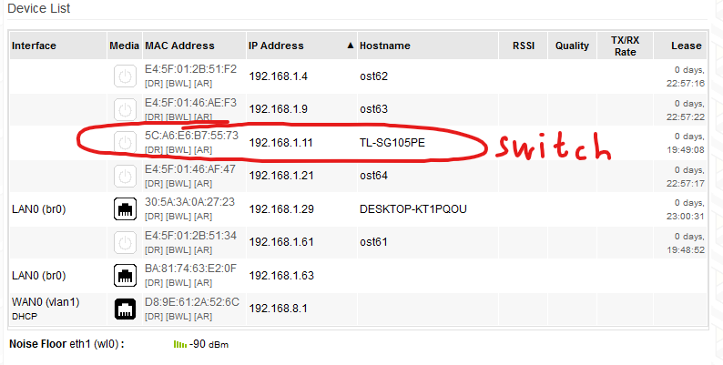
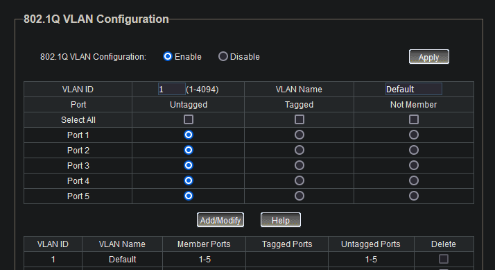
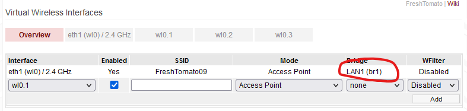
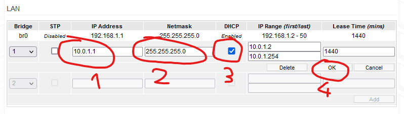
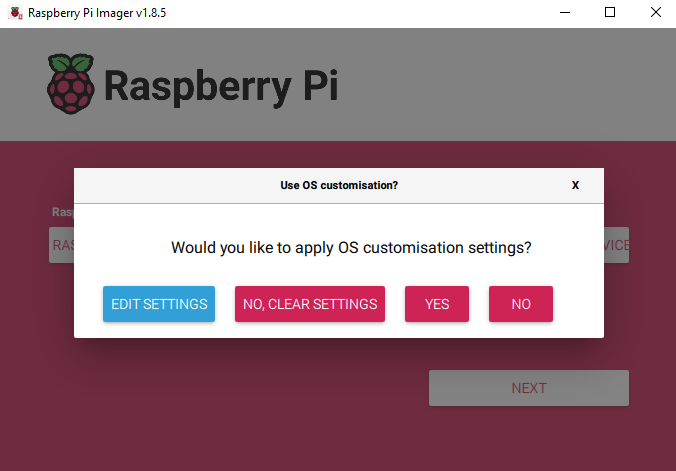
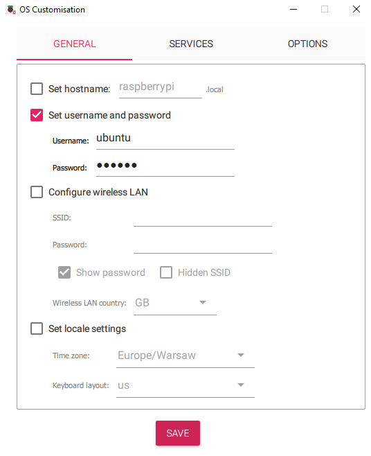
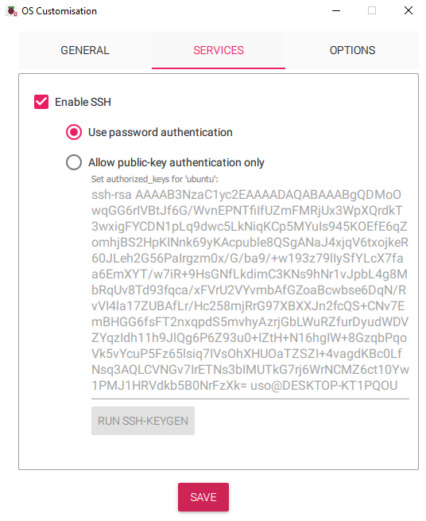

# wstępne przygotowanie routera i switcha

Zresetować je do ustawień fabrycznych

Panel routera znajduje się na IP http://192.168.1.1/  
login:hasło root:admin  

Żeby wejść na panel switcha trzeba sprawdzić w panelu routera w Status->Device List jakie switch dostał IP:


Po resecie powinny być takie ustawienia routera:
### LINKSYS
- release FreshTomato v.2022.6
- ruter/WiFi
  192.168.1.1
  user/pwd/wifi-key: klasterek/klasterek/klasterek
  SSID FreshTomato06

Switch też zresetować, tam ważne żeby na początku nie było ustawionych vlanów w zakładce VLAN->802.1Q VLAN, czyli w ten sposób jest dobrze:  


## Ustawić wstępnie router
Izolujemy sieć WiFi od sieci providerskiej ethernet
W panelu routera w zakładce Basic->Network należy stworzyć bridge br1 i przypisać go do WiFi w zakładce Advanced->Virtual Wireless.



# Przygotowanie raspberry pi
## Robimy dla każdego raspberry pi

### Przykładowa adresacja hostów Raspberry Pi
ost61: 192.168.1.61
ost62: 192.168.1.62
ost63: 192.168.1.63
ost64: 192.168.1.64

## zapisywanie systemu na kartach microsd
Raspberry pi imager jest przetestowany https://www.raspberrypi.com/software/

Wybieramy w nim Raspberry Pi, Ubuntu Server 23.10 (64-bit) i włożoną do komputera kartę microsd.  
Po kliknięciu Next pokaże się pytanie o wgranie wstępnych ustawień żeby nie trzeba było ręcznie włączać ssh z poziomu offline, metodą klawiatura + monitor.  


Wybieramy Edit Settings, ustawiamy login i hasło na stronie General, a włączamy ssh na stronie Services, opcja Password Authentication jest ok.  

#### Ustawiamy login:hasło ubuntu:ubuntu.  




Zapisujemy, klikamy Yes na poprzednim pytaniu i czekamy na pobranie i zapisanie systemu na kartę.

Tak zapisujemy wszystkie 4 karty dla Raspberry Pi.  
Gotowe karty wstawiamy do Raspberry Pi i idziemy dalej.

## Mamy już zainstalowane Ubuntu
Na początku nie ma ustawionych statycznych IP, więc trzeba sprawdzić na routerze jakie IP dostały Raspberry Pi z DHCP.  
W menu Status->Device List po lewej stronie sprawdzamy IP, jakie Raspberry Pi dostały z DHCP na routerze.  
Logujemy się na nie przez SSH, np. jeśli IP jakiegoś RbPi to 192.168.1.21 to `ssh ubuntu@192.168.1.21` w cmd, albo dowolnym programem do ssh.  

### Teraz zajmujemy się konfiguracją wszystkich Raspberry Pi, następującą część robimy 4 razy, raz na każdym Raspberry Pi, można usiąć w kilka osób i robić równolegle.

warto stworzyć swap bo malinki 4GB potrafią zapchać ram podczas instalacji kolla-ansible.  
```bash
sudo fallocate -l 10G /swapfile
sudo chmod 600 /swapfile
sudo mkswap /swapfile
sudo swapon /swapfile
echo '/swapfile none swap sw 0 0' | sudo tee -a /etc/fstab
```

ważna sprawa. żeby veth miały różne adresy MAC trzeba im wygenerować unikalne seedy.  
```bash
sudo rm /etc/machine-id
sudo rm /var/lib/dbus/machine-id
sudo dbus-uuidgen --ensure=/etc/machine-id
sudo cp /etc/machine-id /var/lib/dbus/machine-id
```

warto wyłączyć pytanie o hasło do sudo, żeby ciągle nie wpisywać. Możliwe nawet, że ansible czy coś innego wymaga wyłączonego pytania o hasło.  
w pliku /etc/sudoers zmienić linię z %sudo na  
```
%sudo ALL=(ALL:ALL) NOPASSWD: ALL
```

ustawienie hostname.
```bash
hostnamectl set-hostname ost61
```
w /etc/hosts trzeba wpisać hostname
#127.0.0.1	ost61

dodać kilka folderów z binarkami do path
```bash
sudo tee -a ~/.bashrc << EOT
export PATH=$PATH:/usr/local/sbin:/usr/sbin:/sbin
EOT
```

konfiguracja eth0 dla networkd
```bash
sudo tee /etc/systemd/network/20-wired.network << EOT
[Match]
Name=eth0

[Network]
DHCP=yes
EOT
```

instalowanie aktualizacji i kilku rzeczy które się potem przydają
```bash
sudo apt remove unattended-upgrades -y
sudo apt update && sudo apt upgrade -y
sudo apt install sshpass lm-sensors net-tools qemu-kvm -y
```
jeśli trafi się błąd o certyfikatach, których okres ważności *jeszcze* się nie zaczął, to pewnie klient ntp nie działa poprawnie  
zostało to zaobserwowane przy instalowaniu systemu i używaniu raspberry pi w sieci akademika riviera

zmodyfikować /etc/sysctl.conf
```
net.ipv4.ip_forward=1
```
i zastosować zmiany
```bash
sudo sysctl -p
```

Dodanie połączenia WiFi na RbPi  
Przed wykonaniem dopasować ip RbPi  

```
sudo tee /etc/netplan/50-cloud-init.yaml << EOT
###########################################
# Konfiguracje sieciowe dla Lab OpenStack #
###########################################

network:
  version: 2
  renderer: networkd

#-----------------------------------------#
# Konfiguracja WiFi RbPi jako ratunkowego #
#-----------------------------------------#

# Interfejs wlan0 dostanie IPaddr z Linksysa przez DHCP.
  wifis:
    wlan0:
      access-points:
        FreshTomato09:
          password: klasterek
      dhcp4: true
      optional: true

  ethernets:
    eth0:
      dhcp4: false
      dhcp6: false
      optional: true
      addresses:
        - 192.168.1.6x/24   # dopasowac adres do raspberry
      nameservers:
        addresses:
          - 192.168.1.1     # dhcp na Linksysie
          - 8.8.8.8
      routes:
        - to: 0.0.0.0/0
          via: 192.168.1.1  # dhcp na Linksysie
EOT
```


Dodanie wirtualizacji dwóch ethernetów w RbPi  
Dopasować ip i wykonać na RbPi  

```
sudo tee -a /etc/netplan/50-cloud-init.yaml << EOT
###########################################
# Konfiguracje sieciowe dla Lab OpenStack #
###########################################

network:
  version: 2
  renderer: networkd

#-----------------------------------------#
# Konfiguracja WiFi RbPi jako ratunkowego #
#-----------------------------------------#

# Interfejs wlan0 dostanie IPaddr z Linksysa przez DHCP.
  wifis:
    wlan0:
      access-points:
        FreshTomato09:
          password: klasterek
      dhcp4: true
      optional: true

#-----------------------------------------#
# Konfiguracje sieciowe dla Kolla-Ansible #
#-----------------------------------------#

# Interfejsy

  ethernets:
    eth0:
      dhcp4: false
      dhcp6: false

    # to bedzie network_interface dla kolla-ansible
    veth0:
      addresses:
        - 192.168.1.6x/24   # dopasowac adres
      nameservers:
        addresses:
          - 192.168.1.1     # dhcp na Linksysie
          - 8.8.8.8
      routes:
        - to: 0.0.0.0/0
          via: 192.168.1.1  # dhcp na Linksysie
    veth1:                  # to bedzie neutron_external_interface dla kolla-ansible;
      dhcp4: false
      dhcp6: false

EOT
```


