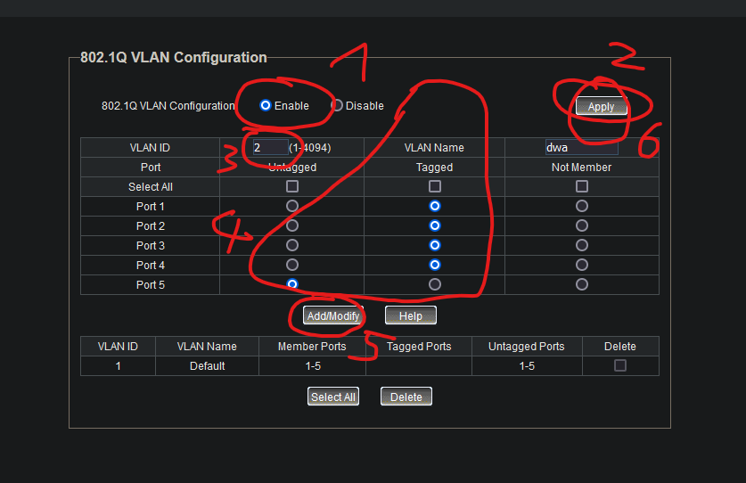
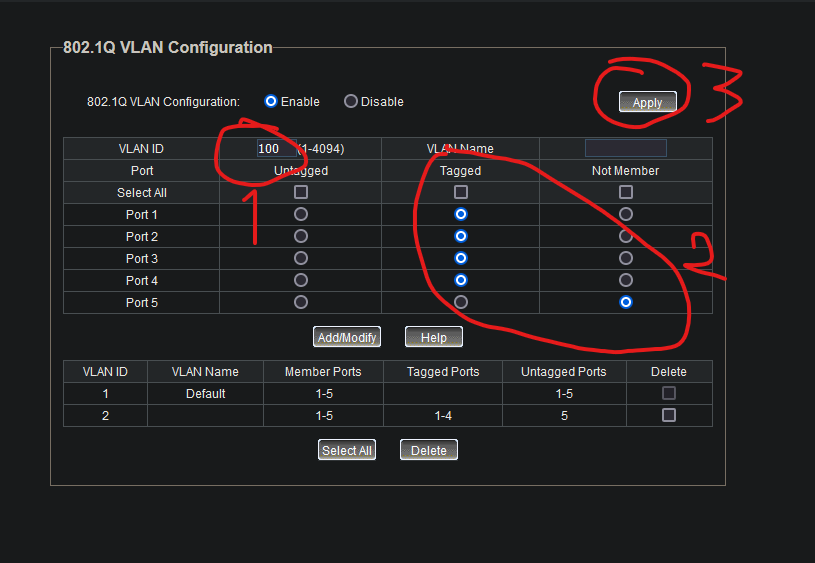
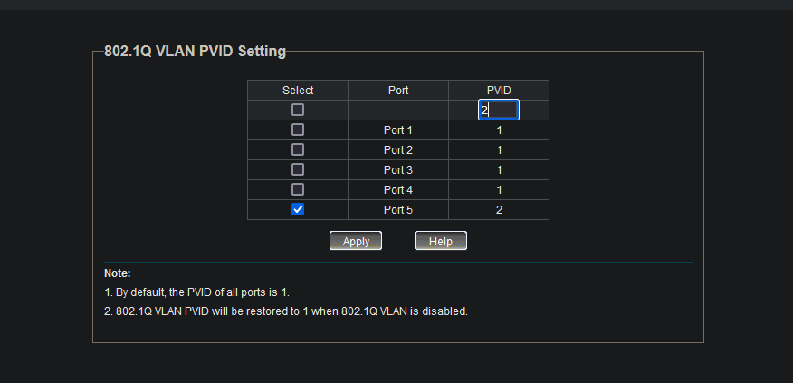
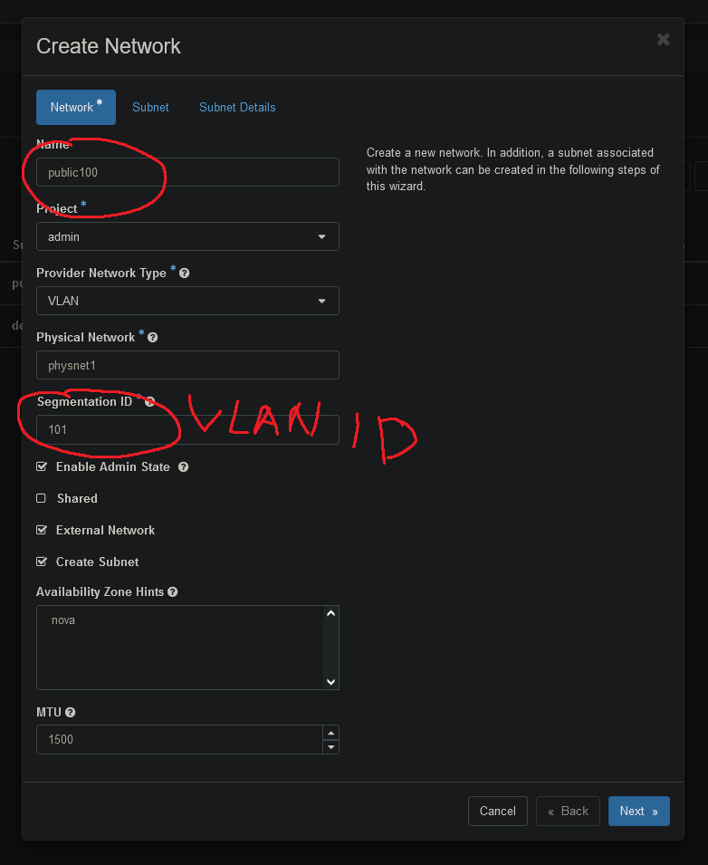

# wstępne przygotowanie routera i switcha

Zresetować je do ustawień fabrycznych

Panel routera znajduje się na IP http://192.168.1.1/  
login:hasło root:admin  

Żeby wejść na panel switcha trzeba sprawdzić w panelu routera w Status->Device List jakie switch dostał IP:


Po resecie powinny być takie ustawienia routera:
### LINKSYS
- release FreshTomato v.2022.6
- ruter/WiFi
  192.168.1.1
  user/pwd/wifi-key: klasterek/klasterek/klasterek
  SSID FreshTomato06

Switch też zresetować, tam ważne żeby na początku nie było ustawionych vlanów w zakładce VLAN->802.1Q VLAN, czyli w ten sposób jest dobrze:  


## Ustawić wstępnie router
Izolujemy sieć WiFi od sieci providerskiej ethernet
Przydzielamy inną podsieć dla bridge `br1` wewnątrz routera, do którego będą podłączone urządzenia w sieci WiFi.
W panelu routera w zakładce Basic->Network należy stworzyć bridge `br1` i przypisać go do WiFi w zakładce Advanced->Virtual Wireless.  


Włączamy w routerze funkcję routowania między podsieciami 192.168.1.0/24 i 10.0.1.0/24.  
W produkcyjnym datacenter to słaby pomysł i można tą funkcję na koniec konfiguracji wyłączyć, ale tu potrzebujemy z naszego komputera dostępu jednocześnie do interfejsów WiFi RbPi i do panela switcha.  
Jest to zakładka Advanced->LAN Access w panelu routera.  


Komputer używany do konfiguracji może być podłączony przez sieć WiFi albo po kablu do routera.
Warto w przypadku głowienia się nad niespodziewanymi problemami pamiętać, że komputer podłączony po kablu dostaje ip z podsieci 192.168.1.0/24, a po WiFi z podsieci 10.0.1.0/24.

## Teraz trzeba zrobić restart routera opcją Reboot na dole lewego menu bo inaczej te ustawienia się nie zastosują

# Przygotowanie raspberry pi
## Robimy dla każdego raspberry pi

### Przykładowa adresacja hostów Raspberry Pi
ost61: 192.168.1.61
ost62: 192.168.1.62
ost63: 192.168.1.63
ost64: 192.168.1.64

## zapisywanie systemu na kartach microsd
Raspberry pi imager jest przetestowany https://www.raspberrypi.com/software/

Wybieramy w nim Raspberry Pi, Ubuntu Server 23.10 (64-bit) i włożoną do komputera kartę microsd.  
Po kliknięciu Next pokaże się pytanie o wgranie wstępnych ustawień żeby nie trzeba było ręcznie włączać ssh z poziomu offline, metodą klawiatura + monitor.  


Wybieramy Edit Settings, ustawiamy login i hasło na stronie General, a włączamy ssh na stronie Services, opcja Password Authentication jest ok.  

#### Ustawiamy login:hasło ubuntu:ubuntu.  


Zapisujemy, klikamy Yes na poprzednim pytaniu i czekamy na pobranie i zapisanie systemu na kartę.

Tak zapisujemy wszystkie 4 karty dla Raspberry Pi.  
Gotowe karty wstawiamy do Raspberry Pi i idziemy dalej.

## Mamy już zainstalowane Ubuntu
Na początku nie ma ustawionych statycznych IP, więc trzeba sprawdzić na routerze jakie IP dostały Raspberry Pi z DHCP.  
W menu Status->Device List po lewej stronie sprawdzamy IP, jakie Raspberry Pi dostały z DHCP na routerze.  
Logujemy się na nie przez SSH, np. jeśli IP jakiegoś RbPi to 192.168.1.21 to `ssh ubuntu@192.168.1.21` w cmd, albo dowolnym programem do ssh.  

### Teraz zajmujemy się konfiguracją wszystkich Raspberry Pi, następującą część robimy 4 razy, raz na każdym Raspberry Pi, można usiąć w kilka osób i robić równolegle.

warto stworzyć swap bo malinki 4GB potrafią zapchać ram podczas instalacji kolla-ansible.  
```bash
sudo fallocate -l 10G /swapfile
sudo chmod 600 /swapfile
sudo mkswap /swapfile
sudo swapon /swapfile
echo '/swapfile none swap sw 0 0' | sudo tee -a /etc/fstab
```

ważna sprawa. żeby veth miały różne adresy MAC trzeba im wygenerować unikalne seedy.  
```bash
sudo rm /etc/machine-id
sudo rm /var/lib/dbus/machine-id
sudo dbus-uuidgen --ensure=/etc/machine-id
sudo cp /etc/machine-id /var/lib/dbus/machine-id
```

warto wyłączyć pytanie o hasło do sudo, żeby ciągle nie wpisywać. Możliwe nawet, że ansible czy coś innego wymaga wyłączonego pytania o hasło.  
w pliku /etc/sudoers zmienić linię z %sudo na  
```
%sudo ALL=(ALL:ALL) NOPASSWD: ALL
```

ustawienie hostname.
```bash
hostnamectl set-hostname ost61
```
w /etc/hosts trzeba wpisać hostname
#127.0.0.1	ost61

dodać kilka folderów z binarkami do path
```bash
sudo tee -a ~/.bashrc << EOT
export PATH=$PATH:/usr/local/sbin:/usr/sbin:/sbin
EOT
```

konfiguracja eth0 dla networkd
```bash
sudo tee /etc/systemd/network/20-wired.network << EOT
[Match]
Name=eth0

[Network]
DHCP=yes
EOT
```

instalowanie aktualizacji i kilku rzeczy które się potem przydają
```bash
sudo apt remove unattended-upgrades -y
sudo apt update && sudo apt upgrade -y
sudo apt install sshpass lm-sensors net-tools qemu-kvm -y
```
Jeśli trafi się błąd o certyfikatach, których okres ważności *jeszcze* się nie zaczął, to pewnie klient ntp nie działa poprawnie.  
Zostało to zaobserwowane przy instalowaniu systemu i używaniu raspberry pi w sieci akademika riviera.  

zmodyfikować /etc/sysctl.conf
```
net.ipv4.ip_forward=1
```
i zastosować zmiany
```bash
sudo sysctl -p
```

### Najpierw robimy edukacyjnie konfigurację na sieci flat

Należy wrzucić pliki z folderu flat w tym repozytorium na dysk każdego RbPi.  

### Trzeba w pliku /etc/netplan/50-cloud-init.yaml zmienić IP na przydzielone danemu RbPi

Pliki z folderu `flat/etc/netplan` do folderu `/etc/netplan` na RbPi, a z folderu `flat/etc/systemd/network` do folderu `/etc/systemd/network`  

Te pliki konfigurują RbPi w sieć tzw. flat, czyli bez vlanów. Nie ma izolacji w warstwie Ethernet między tenantów, będzie ona póki co robiona w openstacku przez vxlany, czyli pakowanie Ethernetu w ramki IP.  

Następnie najprościej RbPi zrestartować i powinno być dostępne na przydzielonym w pliku /etc/netplan/50-cloud-init.yaml statycznie IP.  
Jeśli tak jest to gratulacje, można zaczynać instalację samego openstacka.

## Instalacja openstacka
Openstacka instaluje się z oddzielnej maszyny managementowej, my zrobimy ją jako maszynę wirtualną w virtualbox.
Instalujemy w virtualbox Ubuntu 23.10 Desktop i teraz działamy na nim.  
Warto się upewnić że jesteśmy w stanie się z niego skomunikować z każdym Raspberry Pi.  
Od tej pory operujemy na maszynie managementowej.  
Ona będzie sama się łączyć i instalować wszystko na skonfigurowanych przez nas wcześniej hostach.  

instalowanie potrzebnych rzeczy  
```bash
sudo apt remove unattended-upgrades -y
sudo apt update && sudo apt upgrade -y
sudo apt install -y ca-certificates curl gnupg sshpass git python3-dev libffi-dev gcc libssl-devpython3-venv
sudo install -m 0755 -d /etc/apt/keyrings
curl -fsSL https://download.docker.com/linux/ubuntu/gpg | sudo gpg --dearmor -o /etc/apt/keyrings/docker.gpg
sudo chmod a+r /etc/apt/keyrings/docker.gpg
echo \
  "deb [arch="$(dpkg --print-architecture)" signed-by=/etc/apt/keyrings/docker.gpg] https://download.docker.com/linux/ubuntu \
  "$(. /etc/os-release && echo "$VERSION_CODENAME")" stable" | \
  sudo tee /etc/apt/sources.list.d/docker.list > /dev/null
sudo apt update
sudo apt install -y docker-ce docker-ce-cli containerd.io docker-buildx-plugin docker-compose-plugin
sudo usermod -aG docker ubuntu
```

tworzenie venv dla instalatora openstacka, czyli kolla-ansible i instalowanie go  
```bash
python3 -m venv master-kolla
source master-kolla/bin/activate
pip install -U pip
pip install 'ansible-core>=2.14,<2.16'
pip install git+https://opendev.org/openstack/kolla-ansible@master
sudo mkdir -p /etc/kolla
sudo chown ubuntu:ubuntu /etc/kolla
```

przygotowanie konfiguracji kolla-ansible  
```bash
cp -r master-kolla/share/kolla-ansible/etc_examples/kolla/* /etc/kolla
cp master-kolla/share/kolla-ansible/ansible/inventory/multinode .
kolla-ansible install-deps
kolla-genpwd

tee ansible.cfg << EOT
[defaults]
host_key_checking=False
pipelining=True
forks=100
EOT

sudo tee /etc/kolla/config/nova/nova-compute.conf << EOT
[DEFAULT]
resume_guests_state_on_host_boot = true
EOT

sudo mkdir /etc/kolla/config/neutron

sudo tee /etc/kolla/neutron-server/ml2_conf.ini << EOT
[ml2]
type_drivers = flat,vlan,vxlan
tenant_network_types = vxlan

[ml2_type_vlan]
network_vlan_ranges = physnet1:100:200

[ml2_type_flat]
flat_networks = physnet1

EOT
```

ustawić w pliku z hasłami, czyli /etc/kolla/passwords.yml, hasło do logowania do m.in. panelu w przeglądarce
```
keystone_admin_password: jakies_zapamietywalne_haslo_np_admin
```

ustawić kilka ustawień openstacka w pliku /etc/kolla/globals.yml
```
kolla_base_distro: "debian"
openstack_tag_suffix: "-aarch64"
kolla_internal_vip_address: "192.168.1.60"
network_interface: "veth0"
neutron_external_interface: "veth1"
nova_compute_virt_type: "kvm"
enable_neutron_provider_networks: "yes"
```

Kopiujemy plik `multinode` ze specyfikacją hostów RbPi należących do klastra.  
```
cp multinode multinode.bak
```

I go edytujemy, ustawiamy tam jedno RbPi jako węzeł control i network, a wszystkie jako węzeł compute.  
Generalnie modyfikujemy tylko początek pliku, reszta jest napisana tak, żeby na podstawie początku przydzieliła konkretne pomniejsze role hostom na bazie ról compute, network albo control.  

Przykładowy początek konfiguracji:  
```
# do każdego węzła przy pierwszym wystąpieniu dopisać dyrektywy ansible_user/password/become (np.):
[control]
ost04 ansible_user=ubuntu ansible_password=ubuntu ansible_become=true

[network]
ost04

[compute]
ost[01:03] ansible_user=ubuntu ansible_password=ubuntu ansible_become=true
ost04
```

instalacja openstacka na hostach
```bash
kolla-ansible -i multinode bootstrap-servers
kolla-ansible -i multinode prechecks
kolla-ansible -i multinode deploy
```

Po zainstalowaniu warto wiedzieć że na stronie http://192.168.1.60 znajduje się ładny GUI panel zarządzania stworzonym przez nas datacenter.  
Długo się ładuje, ale działa.  


## Dodajemy vlany
Teraz podmieniamy niektóre pliki (te, które są obecne w folderze `vlanned/etc/systemd/network`) na wersje z zawartą konfiguracją vlanów.
Po podmianie można zrobić restart RbPi komendą `reboot`, albo zrestartować tylko networking komendami:
```bash
ip link set down brmux
ip link del dev brmux
systemctl restart systemd-networkd
```

Po tych komendach RbPi będzie do czasu dodania VLANów na switchu dostępne tylko przez swoje IP WiFi i to tylko dla komputerów podłączonych przez WiFi, nie przez ethernet.
Dodajemy VLANy w panelu switcha w dwóch miejscach.

Najpierw w zakładce VLAN -> 802.1Q VLAN.  
Włączamy obsługę vlanów przełącznikiem Enable na górze, a potem dodajemy pojedynczo konkretne vlany na portach.
  
Na obrazku jest pokazana konfiguracja dla VLAN 2. Ustawimy jeszcze dla VLAN 100 to samo, ale na porcie 5 ustawimy Not Member.  
  
Untagged oznacza tagowanie wchodzącego ruchu z danego portu jako wybrany VLAN i zdejmowanie taga z wychodzącego ruchu.  
Not Member oznacza, że ten VLAN nawet nie wychodzi tym portem.  

Następnie w zakładce VLAN -> 802.1Q PVID Setting zmieniamy id vlanu do tagowania ruchu wchodzącego z routera czyli na porcie 5 switcha.



## Teraz RbPi powinno być dostępna pod swoim poprzednim statycznym IP, oraz pod przydzielonym IP WiFi.

Można tworzyć w panelu http://192.168.1.60 maszyny wirtualne rozłożone między Raspberry Pi, oraz tworzyć i przypisywać im subnety.  

Subnet tworzy się w zakładce Admin->Network->Networks.  



