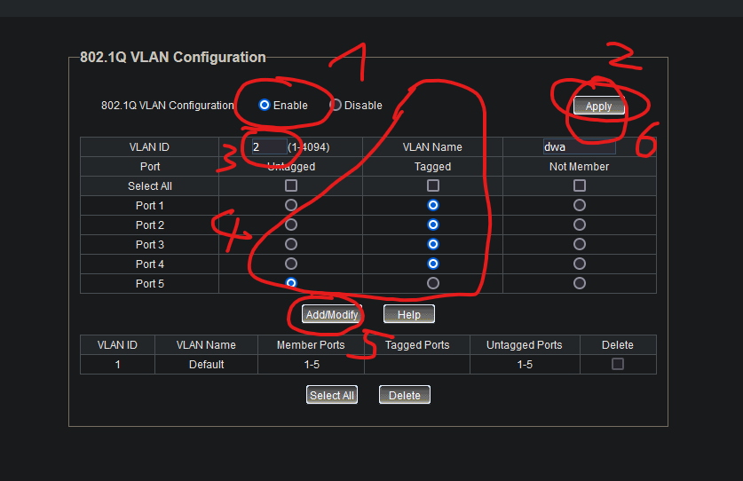

router linksys:  
po resecie jest na ip 192.168.1.1
na typ ip jest webui

przyda się do sprawdzenia, jakie ip raspberry pi i switch dostały z dhcp

na routerze zdecydowanie raczej trzeba stworzyć zapasowe połączenie do raspberry pi 

### tworzenie sieci providerskich
na switchu trzeba stworzyć i dodać do portów vlany, żeby stworzyć sieć providerską w oddzielnym vlanie  

vlan dodaje się w konfiguracji switcha tp-link, strona z konfiguracją jest na ip widocznym na obrazie wyżej, tu jest 192.168.1.11  
domyślny login to admin:admin  
na tej stronie w zakładce VLAN->802.1Q VLAN dodaje się lub modyfikuje vlan w taki sposób:  

na routerze nie ustawia się vlanów, obejmują one raspberry pi i kończą się na switchu  
reszta konfiguracji vlanów jest do zrobienia na hostach raspberry pi, jest w odpowiednich plikach
